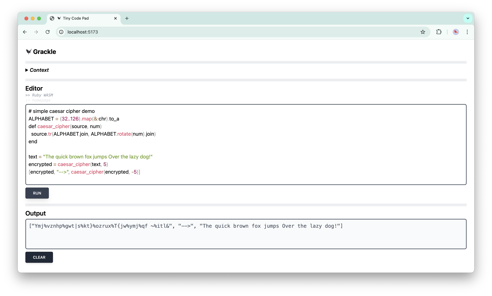

# `grackle-code-pad`

🐦‍⬛ A tiny code pad for your browser.

## Demo

## Features

> [!IMPORTANT]
> This is an early work in progress, more features incoming! 🌱

- [x] Basic code editor interface
- [x] Run Ruby using WASM
- [ ] Google Chrome extension
- [ ] Support other languages
